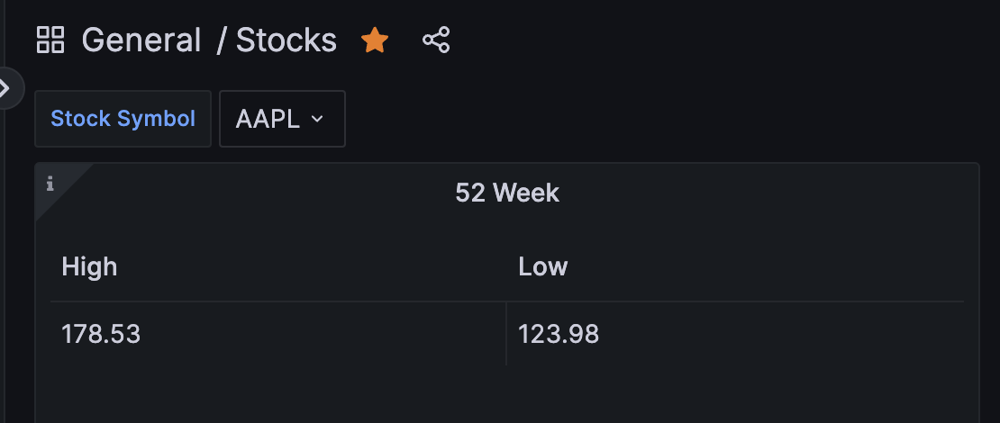

# Stock Data Collection and Visualization

This repository contains a collection of tools for gathering stock information such as earnings, cashflow, and balance data.

## Features

- Customizable to collect data for any publicly traded company.
- Collects earnings, cashflow, and balance data for individual stocks.
- Runs a webserver with all collected data, used as data source (JSON), for easy visualization in a Grafana dashboard.

## Usage

TBD

## Dependencies

This repository relies on the following tools:

- [Grafana](https://grafana.com/) for data visualization.
- [Go](https://golang.org/) for running the data collection scripts.

## Contributing

If you would like to contribute to this repository, please submit a pull request or open an issue for discussion.

## License

This repository is licensed under the MIT License. See the `LICENSE` file for details.

